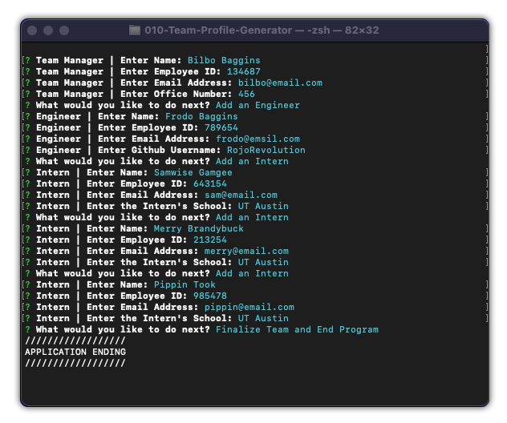

# :rocket: 010-Team-Profile-Generator

[Video of Application in use](https://youtu.be/mnran1fswmQ)

# :zap:	 Description

This project is a command line application built with Node.js. Throgh a series of prompts, the application takes in information about a "team" and generates an HTML file that neatly display's the entire team roster and their information. This project was built as part of a Full-Stack Coding Bootamp offered through UT-Austin, and as such had it's fucnctionality and requirements specifically required. *The HTML templates were already pre-written for this assignment* as the emphasis was on working with Node, as such, the rendered HTMl file is not properly response.

# :zap:	 Installation
To get started, download all files into your directoy of choice. You will need to have Node.js installed, and will need to install the Inquirer Module.

> npm install inquirer

# :zap:	Usage

To run the program, simply call the app.js file through node.

>node app.js

You will then begin a series of prompts beginning with questions about the Manager of your team. Once the manager information has been completed, you will then be able to choose between Adding an Engineer, adding an Intern, or ending the program. This same prompt will appear any time you finish adding an Engineer or a n Intern, allowing you to continue adding employees to your team until you choose to end the program.

Once the node program has ended, a HTML file will either be created, or if replaced if a file already exits within the output directory.

# :zap:	Tests

This program also includes tests for the prompt inputs, which are run through the Jest Module. To run the tests, you will need to first install Jest

> npm install jest

Then simply run the test with the following command.

>npm run test

# :zap:	License

This project is covered under the license: MIT